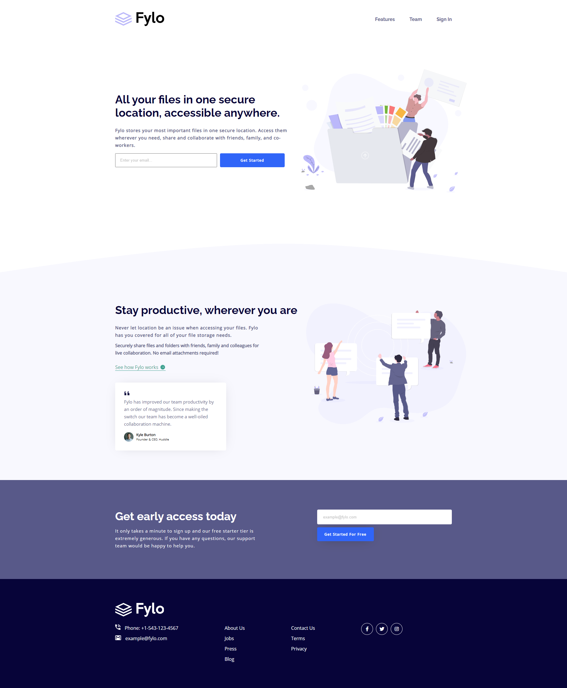
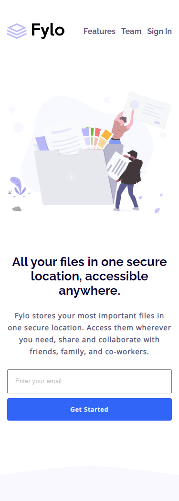
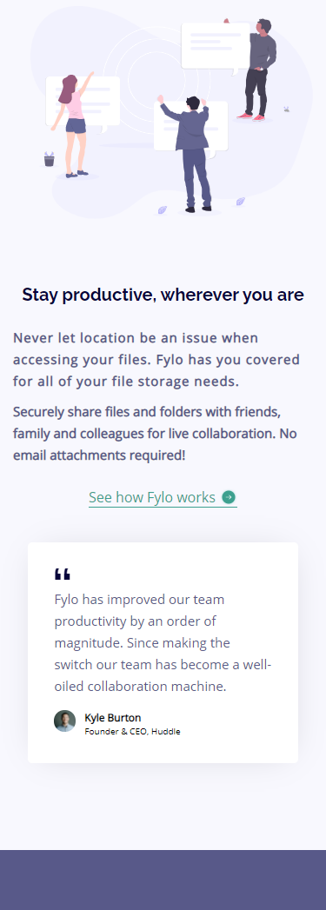
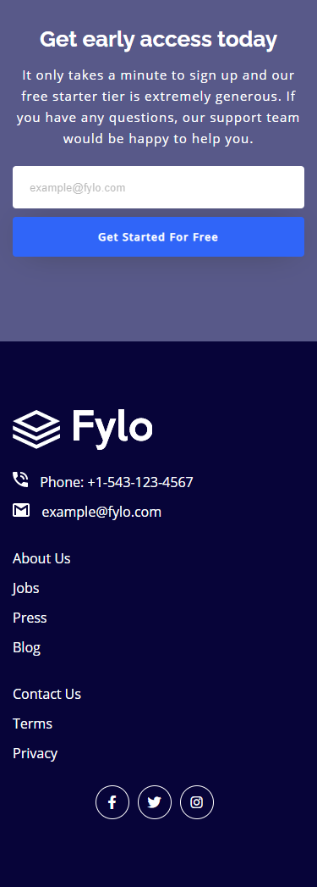

# Frontend Mentor - Fylo landing page with two column layout solution

This is a solution to the [Fylo landing page with two column layout challenge on Frontend Mentor](https://www.frontendmentor.io/challenges/fylo-landing-page-with-two-column-layout-5ca5ef041e82137ec91a50f5). Frontend Mentor challenges help you improve your coding skills by building realistic projects. 

## Table of contents

- [Overview](#overview)
  - [The challenge](#the-challenge)
  - [Screenshot](#screenshot)
  - [Links](#links)
- [My process](#my-process)
  - [Built with](#built-with)
  - [What I learned](#what-i-learned)
  - [Continued development](#continued-development)
  - [Useful resources](#useful-resources)
- [Author](#author)

## Overview

### The challenge

Users should be able to:

- View the optimal layout for the site depending on their device's screen size
- See hover states for all interactive elements on the page

### Screenshot
  

  
  
  

### Links

- Solution URL: [Github link](https://github.com/m-Ash1/fylo-landing-page)
- Live Site URL: [Github pages](https://m-ash1.github.io/fylo-landing-page/)

## My process

### Built with

- Semantic HTML5 markup
- CSS custom properties
- Flexbox
- Grid

### What I learned

I Learned how to build a whole project from scratch not just a simple landing page. also I learnt how to divide page into several sections and give every section padding to seperate every section from another to fit the page at the end at any screen

### Continued development

I will be more consistent and clear while naming the classes and sections. It makes a little bit confusion when I work on bigger projects.

### Useful resources

- [Color Picker Extension](https://chrome.google.com/webstore/detail/colorpick-eyedropper/ohcpnigalekghcmgcdcenkpelffpdolg) - This helped me to pick colors not in the style guide and I use this extension a lot in several projects.
- [Flexbox Zombies](https://mastery.games/flexboxzombies/) - This is an amazing website/game and helped me a lot to understand the concept of flexbox and practice on it with a funny story game.

## Author

- Behance - [Mahmoud Ashraf](https://www.behance.net/m_ashraffarouk/)
- Frontend Mentor - [@m-Ash1](https://www.frontendmentor.io/profile/m-Ash1)
- Twitter - [@m_ashraffarouk](https://www.twitter.com/m_ashraffarouk)
